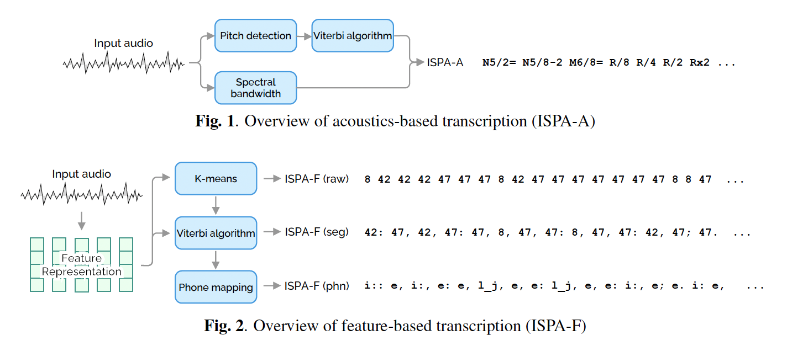

# ISPA: Inter-Species Phonetic Alphabet for Transcribing Animal Sounds



ISPA (Inter-Species Phonetic Alphabet) is a precise, concise, and interpretable system designed for transcribing animal sounds into text, inspired by IPA (International Phonetic Alphabet) used for transcribing human speech sounds into text. See [our paper](https://arxiv.org/abs/2402.03269) for more details.

This repository contains the code and pretrained models for running the transcription.


## Installation

1. Create a conda environment named 'ispa' with the required dependencies:

```
conda create -n ispa python pytorch=1.12.1 cudatoolkit=11.3 torchvision torchaudio cudnn=8.3.2 -c pytorch -c conda-forge
conda activate ispa
```

2. Install the dependencies and ISPA:

```
pip install -r requirements.txt
pip install -e .
```

3. Download the pretrained AVES model:

If you are using the feature-based ISPA with AVES, download and copy AVES-bio models and config (TorchAudio version) from [the AVES repository](https://github.com/earthspecies/aves):


```
wget https://storage.googleapis.com/esp-public-files/ported_aves/aves-base-bio.torchaudio.pt -P models
wget https://storage.googleapis.com/esp-public-files/ported_aves/aves-base-bio.torchaudio.model_config.json -P models
```

## Usage

See [sample.py](./sample.py) for detailed usage examples.

```
from ispa import utils
from ispa.acoustics import run_inference as ispa_a_run_inference
from ispa.features import FeatureBasedISPAPredictor

waveform, sr = utils.load_waveform('1-38560-A-14.wav')
ispa_results = ispa_a_run_inference(waveform, sr)
print("ISP-A results:")
print(ispa_results['text'])
print()

ispa_f_predictor = FeatureBasedISPAPredictor(
    feature_type='mfcc',
    kmeans_model='models/kmeans.mfcc.pkl',
    phoneme_map='models/c2p.mfcc.json')
print("ISP-F results (with MFCC):")
print("(raw):", ispa_f_predictor.predict(waveform, variation='raw'))
print("(seg):", ispa_f_predictor.predict(waveform, variation='seg'))
print("(phn):", ispa_f_predictor.predict(waveform, variation='phn'))
print()

ispa_f_predictor = FeatureBasedISPAPredictor(
    feature_type='aves',
    kmeans_model='models/kmeans.aves.pkl',
    phoneme_map='models/c2p.aves.json',
    aves_config_path='models/aves-base-bio.torchaudio.model_config.json',
    aves_model_path='models/aves-base-bio.torchaudio.pt')
print("ISP-F results (with AVES):")
print("(raw):", ispa_f_predictor.predict(waveform, variation='raw'))
print("(seg):", ispa_f_predictor.predict(waveform, variation='seg'))
print("(phn):", ispa_f_predictor.predict(waveform, variation='phn'))
print()
```

This code will generate the following output:

```
ISP-A results:
N6/32= N5/2= N5/8+2 U5/16-2 N6/16-1 N6/4= U5/16= U4/4= U5/16-2 U5/2= U5/8-2 N6/16= N5/16-2 R/8 R/4 R/2 Rx2

ISP-F results (with MFCC):
(raw): 26 44 44 44 44 44 44 44 44 44 44 44 44 44 44 44 ... (omitted)
(seg): 26 44; 44.. 36; 15; 44; 44. 10.. 10. 10.. 10.
(phn): n o~; o~.. 4; t_d_h; o~; o~. t_j.. t_j. t_j.. t_j.

ISP-F results (with AVES):
(raw): 26 26 26 8 31 26 31 31 31 31 22 2 31 31 31 33 33 ... (omitted)
(seg): 26: 31; 33. 22.. 22; 31. 20. 40. 20.. 40. 13, 20, 20.
(phn): kp_}: q; f. t_h.. t_h; q. v. b. v.. b. n, v, v.
```
